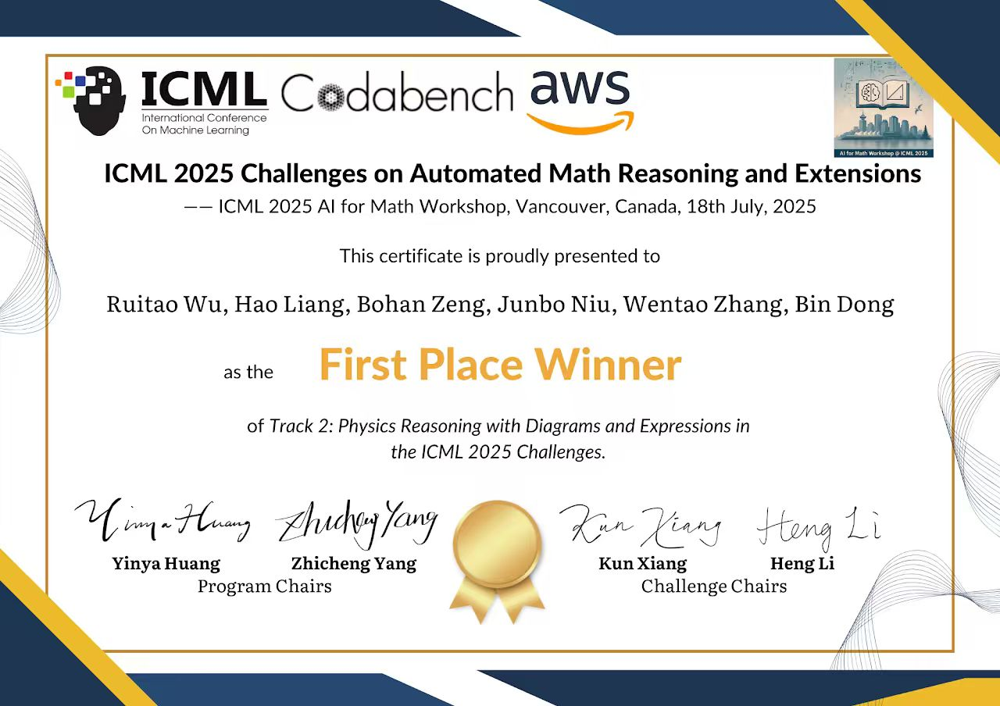

<div align="center">

# SciReasoner

### Multimodal Reasoning for Science

**🥇 1st Place Winner — ICML 2025 AI for Math Workshop, Track 2: Physics Reasoning with Diagrams and Expressions**

[](https://arxiv.org/abs/2509.06079)
[](LICENSE)
[](https://sites.google.com/view/ai4mathworkshopicml2025)
[](https://www.codabench.org/competitions/16010/)



</div>

---

## 📖 Overview

**SciReasoner** is the codebase behind our **first-place solution** to the ICML 2025 AI for Math Workshop's *Physics Reasoning with Diagrams and Expressions* challenge (the original **SeePhys** benchmark), and the active development tree for the 2026 **SeePhys Pro** edition (Codabench competition 16010).

The system implements a **Describe → Answer → Critique & Refine** pipeline that decomposes multimodal physics problem solving into specialized stages:

```
┌──────────┐    ┌──────────┐    ┌──────────┐    ┌──────────┐
│ Caption  │───▶│  Reason  │───▶│  Critic  │───▶│  Refine  │
│ (image)  │    │  (solve) │    │ (review) │    │ (audit)  │
└──────────┘    └──────────┘    └──────────┘    └──────────┘
```

Each stage uses a strong vision-language model (Gemini-3.1-Pro by default) and is independently cached, retryable, and ablatable.

## 📑 Paper

> **Multimodal Reasoning for Science: Technical Report and 1st Place Solution to the ICML 2025 SeePhys Challenge**
> Hao Liang, Ruitao Wu, Bohan Zeng, Junbo Niu, Wentao Zhang, Bin Dong
> arXiv: [2509.06079](https://arxiv.org/abs/2509.06079) (2025)

```bibtex
@article{liang2025multimodal,
  title  = {Multimodal Reasoning for Science: Technical Report and 1st Place
            Solution to the ICML 2025 SeePhys Challenge},
  author = {Liang, Hao and Wu, Ruitao and Zeng, Bohan and Niu, Junbo
            and Zhang, Wentao and Dong, Bin},
  journal= {arXiv preprint arXiv:2509.06079},
  year   = {2025}
}
```

## 🏆 Results

### ICML 2025 — SeePhys Challenge (final ranking)

| Rank | Method                              | Score |
|:----:|:------------------------------------|:-----:|
| 🥇 1 | **SciReasoner (ours)**              | best |

### 2026 — SeePhys Pro (Codabench 16010, public testmini, ongoing)

Iteration log lives in [`seephys_pro_codabench/output/submissions/README.md`](seephys_pro_codabench/output/submissions/README.md). Highlights so far:

| #  | Submission                       | Overall  | L1    | L2    | L3    | L4    | L5    | Note |
|---:|:---------------------------------|:--------:|:-----:|:-----:|:-----:|:-----:|:-----:|:-----|
|  1 | `sub_001_gemini_baseline`        | 0.7651   | 0.770 | 0.810 | 0.755 | 0.700 | 0.933 | pure Gemini-3.1-Pro 3-stage |
|  4 | `sub_004_l4_recaption`           | 0.7747   | 0.765 | 0.810 | 0.760 | 0.740 | 0.933 | L4-specific verbatim-OCR caption (+7q) |
|  8 | **`sub_008_l1_fewshot`**         | **0.7771** | **0.770** | 0.800 | 0.765 | 0.750 | 0.933 | L1 reason prompt with worked examples |

Each submission folder contains the full `submission.zip`, `prediction.csv`, the Codabench `scoring_result.zip`, and a `notes.md` with config + lessons.

## 🗂 Repository Structure

```
SciReasoner/
├── caption.py                          # Original 2025 caption stage (single-model)
├── answer.py                           # Original 2025 answer/critic stage (single-model)
├── README.md
├── LICENSE
├── pyproject.toml                      # pip-installable scireasoner package
├── assets/
│   └── certificate.jpg                 # ICML 2025 First Place certificate
├── scireasoner/                        # Public Python API + CLI + MCP server
│   ├── pipeline.py                     # Thin shell over the live competition pipeline
│   ├── cli.py                          # `scireasoner solve|caption ...`
│   └── mcp_server.py                   # `scireasoner-mcp` (stdio MCP)
├── plugins/                            # One-click installs for AI agents
│   ├── claude-code/scireasoner/        # Claude Code plugin (install.sh + skill)
│   └── codex/scireasoner/              # Codex plugin (install.sh + skill)
├── tests/
│   └── test_pipeline.py                # Offline smoke tests (no API calls)
└── seephys_pro_codabench/              # 2026 SeePhys Pro live iteration
    ├── scripts/
    │   ├── run_v2.py                   # Main 3-stage pipeline (caption→reason→critic)
    │   ├── audit_fix.py                # Deterministic post-processing
    │   ├── run_baseline.py             # Single-stage baseline
    │   └── run_jury.py                 # Heterogeneous-juror voting (ablation)
    └── output/
        └── submissions/
            ├── README.md               # Submission index + lessons
            └── sub_NNN_<tag>/          # Per-submission notes + artifacts
```

> **Design**: `scireasoner/` is a **thin shell** over `seephys_pro_codabench/scripts/run_v2.py`.
> When the SciReasoner authors push prompt or strategy improvements during the
> live SeePhys Pro competition, downstream users automatically get them — just
> `git pull` and (for plugins) re-run `bash install.sh --force`.

## ⚡ Use it in 60 seconds

### As a CLI

```bash
git clone https://github.com/OpenDCAI/SciReasoner.git
cd SciReasoner
pip install -e .

export OPENAI_API_KEY=<your-key>
export OPENAI_BASE_URL=<your-endpoint>      # optional, OpenAI-compatible proxy

scireasoner solve --problem "A 2 kg block slides from rest down a 30° incline of length 5 m, μ = √3/10, g = 10 m/s². Find the speed at the bottom."

# Or with a figure:
scireasoner solve --problem "Find I(t) in this circuit." --image figure.png

# Pipe via stdin:
cat problem.txt | scireasoner solve --image figure.png --json
```

### As a Python library

```python
from scireasoner import solve

res = solve(
    problem="A capacitor C is charged to V0, then discharged through R. Time for energy to drop to U0/4?",
)
print(res.answer)        # → "RC \\ln 2"
print(res.reasoning)     # → full chain of reasoning
```

### Inside Claude Code

```bash
cd plugins/claude-code/scireasoner
bash install.sh
# Restart Claude Code; verify with: claude mcp list
```

The plugin exposes three MCP tools (`scireasoner_solve` / `_caption` / `_reason`) and
auto-triggers a `solve-physics-problem` skill when the user asks Claude to solve a
physics problem with a figure. See [`plugins/claude-code/scireasoner/README.md`](plugins/claude-code/scireasoner/README.md).

### Inside Codex

```bash
cd plugins/codex/scireasoner
bash install.sh
# Restart Codex (Cmd+Q, reopen)
```

Same three MCP tools and skill, integrated into Codex's plugin marketplace. See
[`plugins/codex/scireasoner/README.md`](plugins/codex/scireasoner/README.md).

## 🧪 Reproduce SeePhys Pro 2026 results

### 1. Install with batch extras

```bash
pip install -e ".[batch]"
```

### 2. Download the dataset

```bash
hf download Kun-Xiang/SeePhysPro --repo-type dataset --local-dir ./data/SeePhysPro
```

### 3. Run the 3-stage pipeline

```bash
export OPENAI_API_KEY=<your-gemini-3.1-pro-compatible-key>
export OPENAI_BASE_URL=<your-endpoint>           # optional, e.g. an OpenAI-compatible proxy

python seephys_pro_codabench/scripts/run_v2.py \
    --run v2_pub830 \
    --split testmini \
    --levels level1 level2 level3 level4 level5 \
    --caption-model gemini-3.1-pro-preview \
    --reason-model gemini-3.1-pro-preview \
    --critic-model gemini-3.1-pro-preview \
    --use-critic --k-samples 1 --workers 50
```

The pipeline writes per-stage caches under `output/<run>/cache/{caption,reason,critic,final}/<qid>.json`. Crash-resume is automatic — re-run the same command to continue.

### 4. Audit and package the submission

```bash
python seephys_pro_codabench/scripts/audit_fix.py --run output/v2_pub830
# Produces: prediction_audited.csv, submission_audited.zip, audit_report.md
```

Upload the resulting `submission_audited.zip` to [Codabench competition 16010](https://www.codabench.org/competitions/16010/).

## 🔬 Pipeline Highlights

| Component | Role | Implementation |
|:--|:--|:--|
| **Caption** | Structured figure description (or verbatim OCR for fully-visual problems) | `run_v2.py :: stage_caption()` |
| **Reason** | Step-by-step physics derivation with optional self-consistency `k>1` | `run_v2.py :: stage_reason()` |
| **Critic** | Independent senior-physicist review pass; corrects when wrong | `run_v2.py :: stage_critic()` |
| **Adaptive Routing** | Skip caption when problem text is direct enough (7-domain regex) | `run_v2.py :: route_use_caption()` |
| **Level-specific Caption Templates** | L4 verbatim-OCR (+7q), L23 hybrid in-image extraction | `L4_CAPTION_USER`, `L23_CAPTION_USER` |
| **Few-shot Reason** | 3 worked physics examples for L1 (text-only level) | `REASONER_USER_L1_FEWSHOT` |
| **Audit Layer** | Deterministic fixes (truncation fallback, latex unwrap, multichoice case) | `audit_fix.py` |

## 📜 License

GPL-3.0. See [LICENSE](LICENSE).

## 🙏 Acknowledgements

Thanks to the organizers of the [ICML 2025 AI for Math Workshop](https://sites.google.com/view/ai4mathworkshopicml2025) and the SeePhys / SeePhys Pro challenge for hosting the benchmark, and to AWS / Codabench for compute and infrastructure support.
